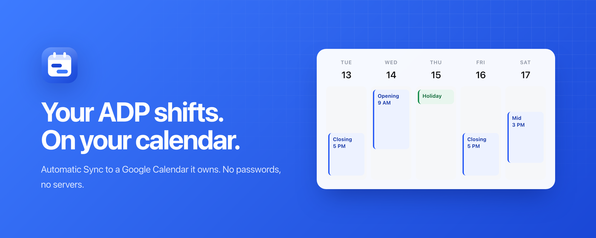

<p align="center"></p>

<h1 align="center">ADP Shifts</h1>

<p align="center">Your ADP Workforce Now schedule, kept current in a Google Calendar of its own.<br />No passwords. No servers. Nothing else touched.</p>

<p align="center"><a href="https://thedavidweng.github.io/adp-calendar/">Website</a> · <a href="https://thedavidweng.github.io/adp-calendar/privacy/">Privacy</a> · <a href="https://github.com/thedavidweng/adp-calendar/issues">Issues</a></p>



## Packages

| Path | What it is |
| --- | --- |
| `packages/core` | Schedule parsing, ICS export, and Sync reconciliation. No browser APIs. |
| `packages/extension` | Manifest V3 extension (WXT) that syncs to a Google Calendar it owns. |
| `packages/userscript` | Tampermonkey userscript that downloads an ICS file. |
| `site` | The website and privacy policy, deployed to GitHub Pages. |
| `store` | Chrome Web Store listing copy, OAuth verification notes, and image sources. |

## Develop

```sh
pnpm install
pnpm test
pnpm typecheck
pnpm build:extension      # packages/extension/.output/chrome-mv3
pnpm --filter @adp-calendar/extension zip:store
python3 store/render.py   # regenerate store images and the social card
```

Set `WXT_GOOGLE_OAUTH_CLIENT_ID` in `packages/extension/.env.local` to enable Google sign-in. Domain language is in [CONTEXT.md](CONTEXT.md) and decisions in [docs/adr](docs/adr).

ADP Shifts is an independent project, not affiliated with ADP, Inc. or Google LLC. MIT licensed.
